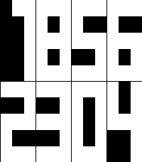

# Waterfall

A minimalist Pebble watchface with a per-column waterfall animation.

  

## Overview

Waterfall displays the current time and date as eight 3×5 pixel digits: hours and minutes on the top half of the screen, day, and month on the bottom. Every minute, the old digits wash away column-by-column from top to bottom, and the new digits cascade down in their place — each column running at its own randomized speed.

## Features

- 8-digit time (`HH:MM`) and date (`DD:MM`) display
- Per-column waterfall animation on every minute tick
- Configurable foreground and background colors
- Supports the basalt (Pebble Time / Time Steel / Time Round) and emery (Pebble Time 2) platforms
